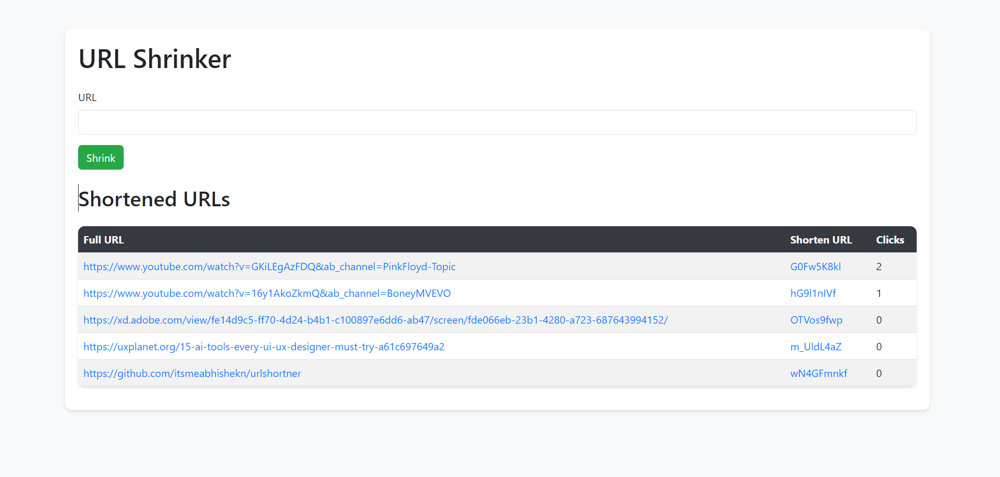

# URL Shortener App

The URL Shortener App is a simple web application that allows users to shorten long URLs, making them easier to share and manage. This app is built using Node.js, Express.js, MongoDB, and EJS.



## Features

- Shorten long URLs to generate easy-to-share short URLs.
- Display a list of shortened URLs along with their original URLs and click counts.
- Responsive and attractive UI using Bootstrap for styling.
- User-friendly form for submitting URLs to be shortened.
- Backend powered by Express.js to handle routing and data interactions.
- Data storage using MongoDB to store the shortened URLs and their related data.

## Getting Started

### Prerequisites

- Node.js: Install Node.js from the [official website](https://nodejs.org/).

### Installation

1. Clone the repository:
   ```bash
   git clone https://github.com/your-username/url-shortener.git
   cd url-shortener
   ```

2. Install dependencies:
   ```bash
   npm install
   ```

3. Start the server:
   ```bash
   node server.js
   ```

4. Access the app in your browser at `http://localhost:9000`.

## Usage

1. Open the app in your browser.
2. Enter a long URL in the provided input field.
3. Click the "Shrink" button to generate a short URL.
4. The shortened URL will be displayed in the table below.
5. Click on the short URL to visit the original URL.
6. The "Clicks" column indicates the number of times the short URL has been clicked.

## Technologies Used

- Node.js
- Express.js
- MongoDB
- EJS (Embedded JavaScript)
- Bootstrap (for styling)
- HTML
- CSS

## Acknowledgements

This app was created as a part of a learning project and is not intended for production use. Feel free to use, modify, and enhance it according to your needs.

